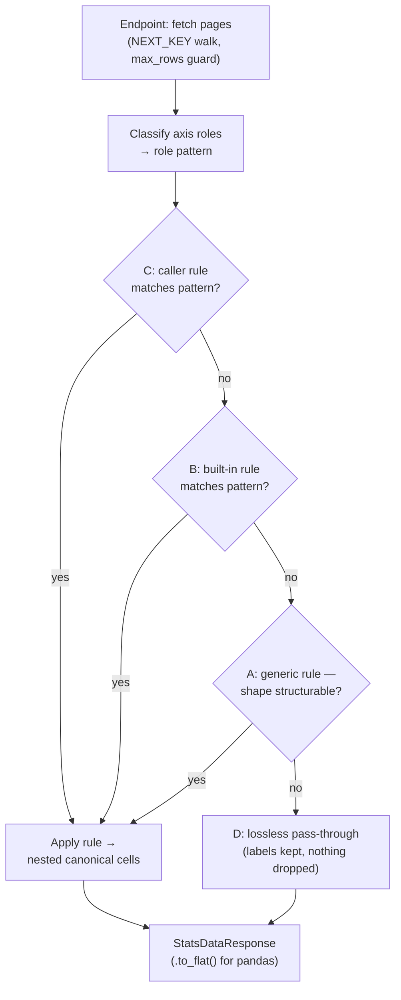

# pyestat Architecture

This document is the as-built shape of pyestat: the four layers, how
`rule="auto"` resolves a table, and the two output/error contracts a
glance at the source does not make obvious. Detail past these
boundaries lives in the code — start from the engine module map below
and read it.

## Layers

Four layers, transport at the bottom, caller-facing at the top.
Dependency is strictly upward: a higher layer imports a lower one,
never the reverse.

1. **HTTP I/O** (`_http.py`) — `EstatHttpClient` wraps `httpx` with
   retry, timeout, and a `progress` callback. Knows nothing of e-Stat's
   meaning. Retries 5xx, connection failure, timeout, and the transient
   408 / 429; e-Stat logical errors (HTTP 200 with `RESULT.STATUS != 0`)
   fail immediately. The caller injects the e-Stat appId explicitly via
   `EstatClient(app_id=...)` (or `EstatHttpClient` directly); pyestat never
   reads it from the environment or a config file, leaving secret
   management to the caller, and a missing appId surfaces as a `ValueError`.
2. **Endpoint** (`_endpoint.py`) — `EstatClient` maps kwargs to query
   parameters, parses JSON, raises `EstatApiError` on a non-zero
   `RESULT.STATUS`, and walks `NEXT_KEY` pages. Covers `getStatsData`,
   `getMetaInfo`, `getStatsList`. A `cntGetFlg=Y` pre-flight enforces
   `max_rows` before any data page downloads (`TooManyRowsError`).
3. **Rule engine** (`_engine/`) — classifies axes, resolves a rule, and
   applies it to the row stream. The expansion-heavy layer; see the
   module map.
4. **Use case** — caller-side multi-step helpers (table discovery,
   cross-table alignment). No module ships today; the layer is a
   reserved name, not code.

Layer 2 hands Layer 3 typed response objects, not raw JSON. The engine
imports `ClassObj` from the endpoint at module load; to keep that
dependency one-way, the endpoint imports the engine lazily inside
`EstatClient.__init__`, not at module top.

### Engine module map (`_engine/`)

- `registry` — name → implementation lookup primitive.
- `time` — built-in time parsers plus the total `best_effort_time`.
- `rule` — `RuleV2`, the output-schema pydantic model.
- `loader` — YAML loader for the schema (`YamlRuleLoader`).
- `classifier` — axis classifier: role + confidence (Layer A keystone).
- `role_defaults` — role-default registry and short-form expansion.
- `resolver` — v2 rule resolution across layers C > B > A.
- `apply` — runs the resolved rule over the rows.
- `builtin` — loader for the library-bundled rules.

## How `rule="auto"` resolves a table

`rule="auto"` (the default) classifies each axis's role, then walks four
resolution layers, stopping at the first that yields a usable rule.

The diagram is the *selection* flow — which rule wins. Its `Fetch` and
`StatsDataResponse` ends are shown for continuity; they are defined under
Layers and Output shape. A selected rule can still fail when applied —
whether that surfaces or degrades to D is the next section.

The four layers, in order:

- **C — caller rule**: a v2 rule the caller passed (`user_rules=`) or
  dropped in `./pyestat_rules/*.yaml` (auto-discovered by file
  placement), matched by the table's role pattern.
- **B — built-in rule**: a bundled v2 rule for the same role pattern
  (`pyestat/rules/builtin/`).
- **A — generic rule**: a rule derived from the classified roles when no
  authored rule matches and the shape is structurable.
- **D — lossless fallback**: a pass-through that attaches labels and
  drops nothing, applied when no C/B/A rule fits — a low-confidence axis,
  or a shape the generic rule declines.

Rules match on **role pattern** — the set of axis roles the classifier
infers (`value`, `time`, `area`, `category`, `meta-axis`, …) — so one
rule covers every table sharing that pattern rather than one rule per
`statsDataId`. A rule's optional `match.statsCode` is an extra
AND-narrowing: unset applies to any statistic family, set requires the
table's family to confirm.

The `rule=` parameter has four forms; only `"auto"` runs the chain above:

- `None` — raw rows, original codes, no normalization. Always works.
- `"auto"` — the four-layer resolution.
- `"heuristic"` — label substitution only: each axis gains an additive
  `{axis_id}_label` beside its raw code. No standard-code mapping, no
  aggregate exclusion.
- `RuleV2(...)` — one explicit rule applied directly, bypassing the chain.

## Failure policy: surface vs degrade

Resolving a rule does not guarantee it applies — a role may be absent
from the table, a short-form column may not expand, or a column may name
an unknown transform. Who *authored* the failing rule decides what
happens:

- A **caller-authored** rule (an explicit `rule=RuleV2(...)`, or a
  matching `user_rules=` / `./pyestat_rules` rule) fails loud: a typed
  `EstatError` the caller can fix and re-run.
- A **library-provided** rule (a built-in, or the generic Layer A rule)
  degrades to the lossless Layer D. The caller cannot edit it, so
  preserved raw data beats an error they have no power to resolve.

Same-layer conflicts follow the same split: two caller rules claiming
one role pattern raise `AmbiguousRuleError`, while two built-ins
conflicting is skipped (a packaging bug for CI to catch) and falls
through to the generic rule or Layer D. A declared *strict* time format
(`yearly` / `monthly_e_stat` / `quarterly_e_stat`) that the table's codes
violate is a `TimeFormatError` routed by this same provenance rule — an
authoring decision, not a guess to silently override. The total
`best_effort_time` default (what short-form columns and the generic rule
inherit) never raises, so the no-rule paths cannot fail on a time code.

## Output shape: nested canonical cells

`rule="auto"` returns one canonical record shape on every path. Each
field is a self-describing object:

| Cell | Shape | Notes |
|---|---|---|
| dimension (category / area / tab) | `{code, label}` | A label-less code (trade HS, where `code == name`) carries its code as the label, so the cell is never partial. |
| time | `{code, label, normalized, granularity}` | Raw code, e-Stat display name, ISO-leaning normalized string, granularity tag. An unrecognised code keeps `normalized == code` and `granularity = None`. |
| measure (observation) | `{value, unit}` | Pairing each value with its own unit keeps a pivoted table correct when measures carry different units (trade's 数量 in ＮＯ vs 金額 in 千円). |

Nested is canonical because it is self-describing — an agent reads
`row["cat01"]["label"]` without knowing a suffix convention — and because
nested → flat is a cheap lossless projection while flat → nested would
need fragile re-pairing by suffix. `StatsDataResponse.to_flat()` gives
pandas users the one-column-per-field shape (`cat01` / `cat01_label`;
`value` / `unit`); `rule=None` rows pass through unchanged and
`to_flat()` is a no-op on them.

Two output columns can map to one flat key (a column `unit` beside a `value`
measure). The nested form is unaffected, so this surfaces only at `to_flat()`:
a caller's rule raises a `FlatProjectionError` (rename a column), a built-in
degrades to Layer D by the same provenance rule as an apply failure.

## Extension points

| Want to add | Touch |
|---|---|
| Async client | Layer 1: add an async `EstatHttpClient` peer; Layers 2–4 unchanged |
| New endpoint (CSV, data catalog) | Layer 2: add a method plus its response model |
| Coverage for a new table shape | Author a v2 rule keyed by role pattern — `user_rules=`, `./pyestat_rules`, or bundle it |
| New time format or transform | Register it in the engine registry (`_engine/registry`; time parsers in `_engine/time`) |
| New use-case helper | Layer 4: a new caller-side module |

## Out of scope

- **Caching of e-Stat responses** — the library is stateless; caching is
  the caller's concern.
- **Structured logging / tracing** — the `progress` callback covers the
  multi-page-fetch observability need.
- **Statistical portals other than e-Stat** — no cross-source
  abstraction layer.
