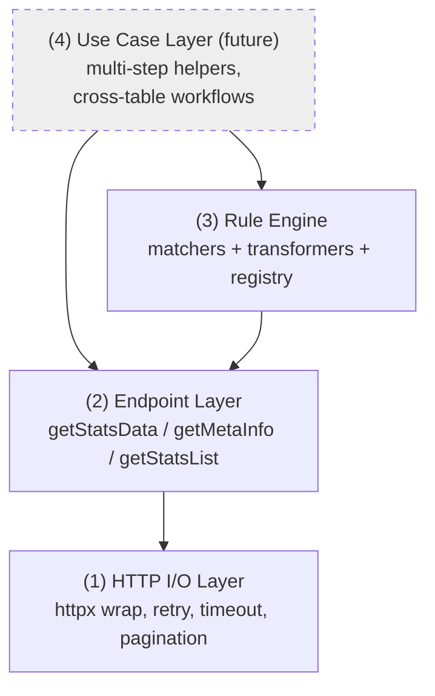
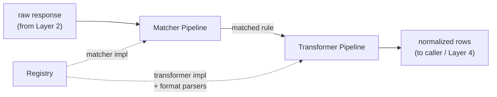
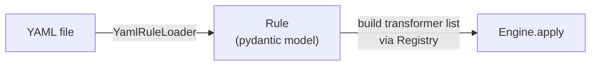
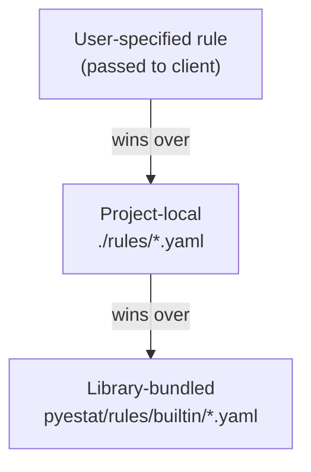
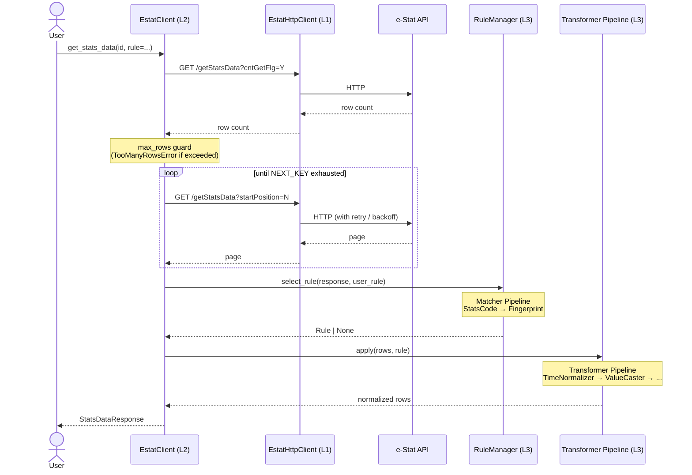
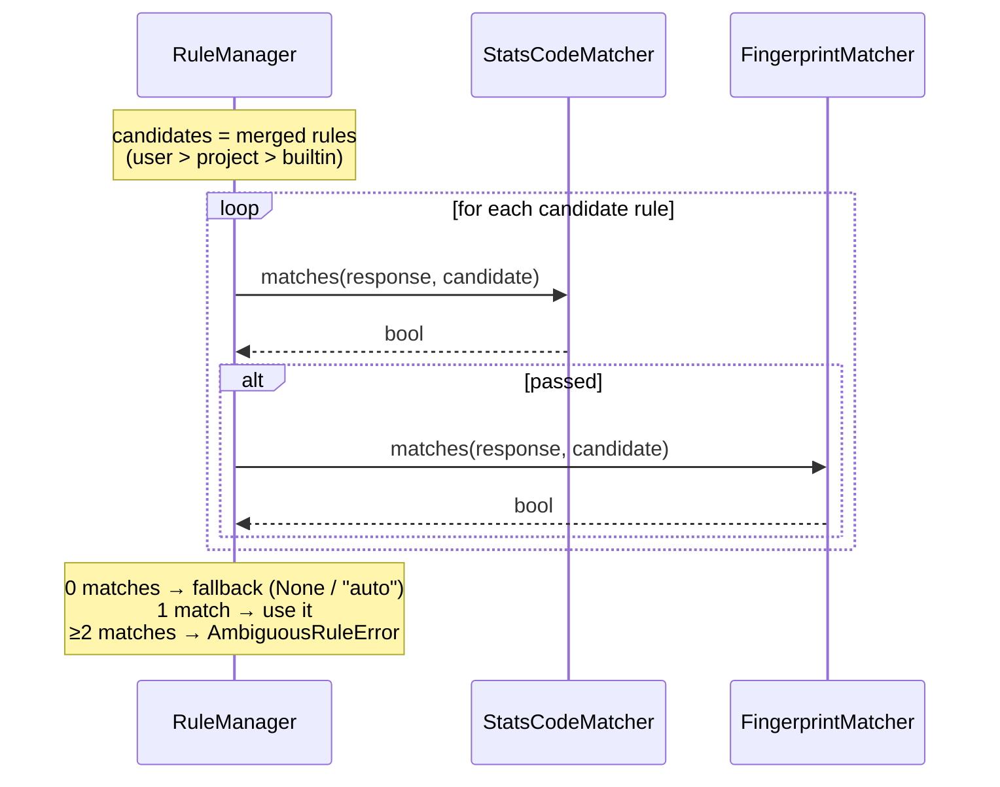

# pyestat Architecture

Captured: 2026-05-20. Describes the structural layering and the
extension points that DESIGN.md's decisions translate into. Read
DESIGN.md first for the "why"; this document is the "how".

This document is the **shape** of the library: boundaries, contracts,
and where future change is expected to land. Implementation detail
beyond those boundaries lives in the code, not here.

## Overview

Four layers, ordered from transport (bottom) to caller-facing
ergonomics (top):



The Use Case Layer is shipped at MVP as an empty package containing
only a Protocol stub — the dashed border above marks it as a
declared extension point, not implemented behavior.

Dependency direction is strictly upward: higher layers depend on
lower ones, never the reverse. This keeps each extension point
local to one layer.

## Layer 1: HTTP I/O

**Responsibility**: speak HTTP to e-Stat. Nothing about e-Stat's
business meaning lives here.

**Surface (MVP)**:

- `EstatHttpClient` (sync) — wraps `httpx.Client` with retry,
  timeout, and `progress` callback support (Decision I).
- `ProgressEvent` dataclass.

**Extension point**: a future `AsyncEstatHttpClient` implements the
same conceptual contract on `httpx.AsyncClient`. Layers 2–4 must not
import `httpx` directly so this swap is local (Decision H).

**Out of scope here**: JSON parsing, `RESULT.STATUS` inspection,
pagination logic. Those live in Layer 2.

## Layer 2: Endpoint

**Responsibility**: speak e-Stat REST. Maps Python kwargs to query
parameters, parses JSON, raises `EstatApiError` on logical failures,
manages multi-page `NEXT_KEY` walks.

**Surface (MVP)**:

- `EstatClient.get_stats_data(stats_data_id, *, max_rows=None, progress=None) -> StatsDataResponse`
- `EstatClient.iter_stats_data_pages(stats_data_id, *, progress=None) -> Iterator[Page]`
- `EstatClient.get_meta_info(stats_data_id) -> MetaInfoResponse`
- `EstatClient.list_stats(...) -> StatsListResponse`

**Extension point**: adding `getSimpleStatsData` (CSV) or
`getDataCatalog` later is a Layer-2-only change (Decision G). Layer 3
consumes typed response objects, not raw JSON.

**Out of scope here**: rule application, label substitution,
standard-code mapping. Layer 2 returns the raw shape of e-Stat
responses with the `@` / `$` flattening already applied.

## Layer 3: Rule Engine

The expansion-heavy layer. Three sub-components plus a YAML loader:



### 3a. Matcher Pipeline

Selects which rule applies to an incoming table (Decision A).

```python
class Matcher(Protocol):
    def matches(self, response: StatsDataResponse, rule: Rule) -> bool: ...
```

MVP implementations:

- `StatsCodeMatcher` — narrows by `match.statsCode`.
- `FingerprintMatcher` — validates the structural fingerprint
  (axis `@id` set + stable name summary).

The pipeline short-circuits AND: a rule matches only if **all**
Matchers in the pipeline return True. Adding a new matcher (e.g.
`TableIdExactMatcher`, `NamePatternMatcher`) is appending to the
pipeline list — the existing Matchers do not change.

### 3b. Transformer Pipeline

Applies the matched rule's transformations to the row stream.

```python
class Transformer(Protocol):
    def transform(
        self,
        rows: Iterator[Row],
        rule: Rule,
        ctx: TransformContext,
    ) -> Iterator[Row]: ...


@dataclass(frozen=True)
class TransformContext:
    """Per-call context handed to every Transformer in the pipeline.

    MVP fields cover what the bundled Transformers need. New
    Transformers added during expansion extend this struct via
    defaulted fields so existing Transformers stay green:

    - AggregateExcluder will read `class_inf` (needs @parentCode / @level).
    - ConditionalValueTyper will read sibling-axis values from each row
      itself (not from ctx) but uses `axes_meta` to validate the
      keying axis exists.
    - StandardCodeMapper consults its own Registry, not ctx.
    """
    stats_data_id: str                                    # for logging / error context
    class_inf: Mapping[str, tuple[dict[str, Any], ...]]   # axis @id → CLASS entries with @ stripped (@code, @name, @parentCode, @level, ...)
    axes_meta: Mapping[str, str]                          # axis @id → raw @name
```

CLASS entries are kept as plain dicts (with the `@` prefix already
stripped by Layer 2) rather than a typed `ClassDef` dataclass — the
field shape varies across tables (some carry `@unit`, others
`@parentCode`, some neither), so a dataclass would either over-
constrain or amount to the same `dict[str, Any]`. Likewise
`axes_meta` is a plain `str` of the raw axis name rather than an
`AxisMeta` dataclass — Transformers that need the normalized form
compute it locally via the `Fingerprint` helper.

MVP implementations:

- `TimeNormalizer` — looks up `axes.time.format` in the registry;
  emits `time` / `time_granularity` fields alongside the raw
  `time_code`.
- `ValueCaster` — applies `value.type` (`number` / `string`).

Each Transformer is a stream-in / stream-out generator so a 3.8M-row
table never materializes fully in memory.

Pipeline composition: at rule-load time, the engine inspects the
Rule object and assembles a Transformer list. Adding
`AggregateExcluder`, `StandardCodeMapper`, `AxisRenamer`,
`ConditionalValueTyper`, etc. (Decision D expansion table) is:

1. Implement the `Transformer` Protocol.
2. Register the YAML keyword that triggers it in the Rule schema.
3. The Rule loader appends the new Transformer instance to the
   pipeline.

No existing Transformer is touched.

### 3c. Registry

Name-to-implementation resolution for declarative rule values.

```python
class Registry(Generic[T]):
    def register(self, name: str, impl: T) -> None: ...
    def resolve(self, name: str) -> T: ...
    def names(self) -> Iterable[str]: ...
```

MVP registry:

- `TIME_PARSERS` — `"monthly_e_stat" | "quarterly_e_stat" | "yearly"`
  → parser callable.

A `MATCHERS` registry is **not** introduced at MVP. The Matcher
Pipeline is a fixed list in code; rule files do not name matchers.
If a future rule schema ever needs to reference matchers by name, a
registry can be added at that point without touching existing rules.

A user-supplied callable from `value.transform: !python ...` is
**not** registry-resolved — it is loaded by the YAML parser
directly into the Rule object (Decision C's escape hatch).

### YAML → Rule → Engine

Three isolated stages:



The `Rule` pydantic model is the **versioned contract** that task #8's
Rule Authoring Skill targets. Every rule declares a `schema_version`
field (MVP: `"1"`); additive expansions (new optional fields, new
transformer keywords) keep the version constant, while breaking
changes increment it and route through a Rule-loader migration step.
Alternate routes — build a `Rule` from JSON, from Python dicts, or
programmatically — only need to construct a valid `Rule` instance
for the current schema version.

### Rule Resolution Order

Three storage layers (Decision E), resolved at rule-load time:



The Matcher Pipeline runs against the merged candidate set; ties at
the same precedence level raise `AmbiguousRuleError`.

## Layer 4: Use Case Layer (Future)

**Not shipped at MVP.** No module, no Protocol stub, no placeholder
package. The layer is reserved in the architecture as the landing
zone for future multi-step helpers; it materializes when the first
concrete helper is implemented (at which point the Protocol can be
shaped to fit that real helper rather than guessed at).

Likely future inhabitants when the layer does materialize:

- `find_table_by_intent(...)` — combine `getStatsList` results with
  heuristics for "I want CPI data" queries.
- `align_time_series([table_a, table_b])` — pull two tables and
  yield them on a common time-granularity index.

**Not** in this layer when it arrives: natural-language query
processing. That is the calling LLM's responsibility — pyestat
hands it data, not language understanding.

## Cross-Layer Sequences

### Happy path: `get_stats_data(stats_data_id, rule=...)`



### Rule selection detail



## Extension Points Summary

| Want to add | Touch | Don't touch |
|---|---|---|
| async client | Layer 1 (add `AsyncEstatHttpClient`) | Layers 2–4 |
| New endpoint (CSV / DataCatalog) | Layer 2 (add method + response model) | Layers 1, 3, 4 |
| New matcher | Implement `Matcher`; extend pipeline | Existing Matchers / Transformers / L1–2 |
| New transformer | Implement `Transformer`; register YAML keyword | Existing Transformers / L1–2 |
| New built-in time format | Add parser fn; register in `TIME_PARSERS` | Transformer code itself |
| New use case (search, alignment) | Layer 4 (new module) | Layers 1–3 |
| Standard-code normalization (task #4) | New `Transformer` + new `Registry` | L1–2 |
| Rule authoring Skill (task #8) | Outside the library; generates `Rule`-shape YAML | Anything inside the library |

## Out-of-Scope Concerns

- **Plugin discovery via entry points / setuptools hooks.** Costs
  little to add later if Protocols stay clean; deferred until a
  concrete request drives it.
- **Caching of e-Stat responses.** The library is stateless at MVP;
  caching is the caller's concern.
- **Structured logging / tracing.** The `progress` callback covers
  the major observability need (multi-page fetches); deeper tracing
  can be added without architectural change.
