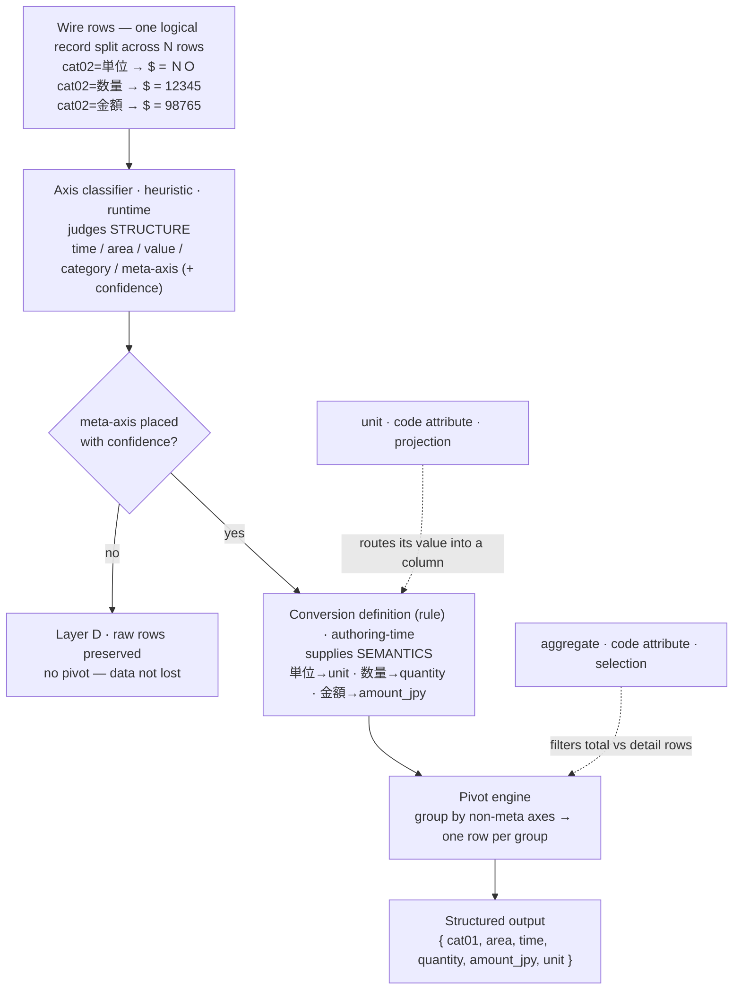

# Proposal: Axis-role inference

**Cut pyestat's rule count from O(tables) to O(role patterns) by
inferring each axis's role from table metadata, so the library scales
to the long tail of e-Stat tables — not just the high-traffic ones we
wrote rules for.**

- **Status**: Proposed
- **Last revised**: 2026-05-31
- **Reader**: pyestat maintainers and future contributors who need to
  understand the proposed pivot away from per-table rules, or who hold
  a task this proposal touches (#4, #8, #10, #13, #15).

This document is the proposal. ARCHITECTURE.md and DESIGN.md continue
to describe the current MVP implementation until this proposal is
accepted and a separate task lands the updates.

## Summary

The field survey (CATALOG.md in `work/research/`) showed that a single
e-Stat `statsCode` binds to up to 30 structural groups, and within a
group axis names drift in two distinct ways. A per-table rule strategy
therefore scales as
`rules = (structural groups) × (semantic variants) × (value-spread
patterns)` — combinatorial in the number of e-Stat tables. With e-Stat
hosting tens of thousands of tables, manual rule authoring cannot keep
up.

Two terms used throughout: *role pattern* = the ordered tuple of axis
roles a classifier assigns to a table (see Role vocabulary below).
*Meta-axis* = an axis whose values are themselves column names of one
logical record (trade's `cat02` is the canonical example).

This proposal restructures the rule layer as a four-layer resolution
— generic role-based defaults (A) → built-in table-specific rules (B)
→ project-local rules (C) → heuristic fallback (D) — built from three
new pieces:

1. **Axis classifier** (feeds Layer A): a new component that observes
   table metadata and labels each axis with a role (`time`, `area`,
   `value`, `unit`, `category`, `meta-axis`, `aggregate`, `unknown`).
2. **Role-pattern matcher** (selects rules across A / B / C): rules
   match on the pattern of roles in a table, not the axis IDs.
3. **Output-schema-first rules** (format for B / C): a rule declares
   the desired output columns directly, with shorthand that lets
   unspecified columns inherit role-default transforms.

Expected effects:

- Rule count compresses from `O(tables)` to `O(role patterns)` for the
  generic layer; specific rules now carry semantic intent rather than
  structural plumbing.
  - As a result, LLM-agent workflows on uncovered tables produce
    structured output via Layer A or Layer D, instead of returning raw
    rows.
- Rule authoring (Skill #8) shifts from "describe the table structure"
  to "edit the proposed output schema."

## Background and motivation

### What the field survey showed

CATALOG.md records the 2026-05-24/25 survey of six statsCodes. Three
findings drive this proposal:

- **Structural multiplicity**: 1 statsCode contains 1–30 distinct
  axis-id signatures (CPI: 1, wage structure: 30). `StatsCodeMatcher`
  alone over-matches.
- **Name drift in two flavors**:
  - *Informative drift* (CPI base year, time granularity): the name
    encodes meaning the matcher should use. Substring matching helps;
    `name_digest` destroys the signal.
  - *Semantic drift* (wage `cat01` is "勤続年数" or "業種"): the name
    signals "different table." `name_digest` works; substring matching
    cannot scale.
- **Value spread in three patterns**: `tab` axis as meta, `cat02` axis
  as meta, or split across separate statsDataIds.

Together these defeat both the "one rule per statsCode" and the "one
matcher strategy fits all" assumptions baked into the MVP.

### Why current Matcher tuning isn't enough

The natural extension to the MVP matcher — adding `axis_names` to the
fingerprint — *increases precision* (fewer false positives) but
*decreases reach per rule* (each rule covers fewer tables). The rule
count grows, not shrinks. Precision tuning alone cannot fix a
combinatorial scaling problem.

### Why this matters under the broadened use cases

USE_CASES.md now treats LLM agents as a primary use case alongside
finance, real estate, research, and personal financial modeling. An
LLM agent calling `getStatsList` and landing on a table for which no
rule was written is the default scenario, not the exception. Without a
generic fallback that still produces structured output, the library's
value to LLM agents is bounded by the rules the maintainers happen to
have written.

## Proposed architecture

From here, the document speaks from the engine's perspective: what the
rule layer does at request time.

### Four-layer resolution

```
Layer A — Generic (built-in, automatic)
    Axis classifier → role pattern → role-default transformers.
    Covers any table where classifier confidence is sufficient.

Layer B — Specific (built-in, hand-authored)
    Output-schema-first rules for high-traffic tables (CPI, GDP, trade …).
    Carries domain-specific semantics (label maps, units, pivot specs)
    that Layer A cannot infer.

Layer C — Specific (project / user-authored)
    Same format as Layer B, dropped into project-local YAML.
    Picked up automatically (#15).

Layer D — Heuristic fallback
    Triggered when Axis classifier confidence is low.
    Returns rows with raw axis IDs and best-effort time / area parsing.
    Preserves data; does not normalize axes.
```

Resolution order: **C > B > A > D**.

### Axis classifier (new component)

The classifier observes a table's metadata and assigns each axis a
role from the controlled vocabulary below.

**Role vocabulary (resolved, see Open question 2).** The vocabulary
operates at *two levels* that the initial flat list conflated. An
**axis role** answers "what is this whole axis?" — exactly one per
axis, and what the classifier assigns. A **code/value attribute**
answers "what is this individual code or cell?" — detected per code,
orthogonal to the axis role, because such facts are held differently in
the wire format and so need different detection (see below).

*Axis roles* (classifier assigns one per axis):

| Role | Meaning | Example |
|---|---|---|
| `time` | Time axis (any granularity) | `time` axis with `2022000101` codes |
| `area` | Geographic / regional axis | `area` axis with JIS codes |
| `value` | Primary observation value | the cell (`$`) extracted as the record's value |
| `category` | Classification / dimension axis | wage age bracket, household goods type |
| `meta-axis` | Pivot meta-axis (one logical record split across N rows) | `tab` (表章項目) when n>1; `cat02` in trade |
| `unknown` | Classifier could not decide | triggers Layer D fallback |

*Code/value attributes* (detected per code; not axis roles):

| Attribute | Meaning | Where it lives in the wire format | Output role |
|---|---|---|---|
| `unit` | Unit-of-measure of a value | an attribute of a value-type entry (CPI/wage/GDP `tab` carries `@unit`), **or** a meta-axis row whose cell is a unit string (trade `単位` → `ＮＯ`) | *projection* — surfaces as an output column at conversion time |
| `aggregate` | Total/parent vs leaf detail | a code's position in the `level` / `parentCode` hierarchy, sometimes needing a name heuristic (`全国` / `総合` / `合計`) | *selection* — a per-row flag used to filter, not a column |

**Responsibility split (so demoting `unit` / `aggregate` does not break
pivot).** The classifier judges *structure* — is an axis a `meta-axis`
(does it split one record across rows)? — not unit semantics. That
structural label is what triggers pivot. The conversion definition
(rule) then supplies the *semantics* — which meta-axis value maps to
which named, typed output column. The `unit` attribute is consumed
downstream (authoring-time schema suggestion in Skill #8; routing
unit-valued meta rows to string columns in a Layer A generic pivot);
`aggregate` is consumed as a row filter. If the classifier cannot place
a `meta-axis` with confidence, the table degrades to Layer D (raw rows
preserved) rather than mis-pivoting. Dependency is one-way: classifier
→ conversion definition.

The flow below traces the trade table through that split — the
classifier decides *whether* to pivot (structure), the rule decides
*how* (semantics), and the two code attributes feed in where they are
used:



The exact output shape (`unit` column naming, how `aggregate` is
carried) is deferred to the conversion-definition format and #10
(pivot); this question fixes only the vocabulary level.

**Inputs the classifier may consider:**

- `axis_id` (often hints at role: `time`, `area` are conventional)
- axis raw name
- `CLASS` vocabulary on the axis (does it look like an ISO 8601 date set? a JIS region set?)
- `TABLE_INF.TITLE_SPEC` prefix
- sibling axes' roles for disambiguation (optional second pass)

**Implementation strategy (resolved, see Open question 1):** the
classifier is **deterministic heuristic at request time** — no LLM call
on the data path. Most roles fall out of e-Stat conventions and CLASS
code shape (`time` / `area` from conventional `axis_id` + date/JIS code
sets; `aggregate` from `parentCode` / `level`; `value` from cell type;
`category` by elimination). The hard role is `meta-axis`, where axis
values carry domain meaning (`数量` / `金額` / `単位`); low classifier
confidence there routes to Layer D rather than to a runtime model. LLM
assistance is confined to authoring time (Skill #8), where it proposes
an output schema a human reviews and saves as a durable Layer B / C
rule — so an ambiguous table is resolved once, not re-inferred on every
call.

### Output-schema-first rule format

A Specific rule declares the **output columns** the caller will
receive, not the input table structure.

Long form:

```yaml
schema_version: "2"
match:
  role_pattern: [time, area, value]   # any table classified as time+area+value
output:
  - column: time
    source: { role: time }
    transform: iso8601
  - column: area
    source: { role: area }
    transform: jis_x_0401
  - column: value
    source: { role: value }
    transform: float
```

Short form (unspecified fields fall back to role-defaults from
Layer A):

```yaml
schema_version: "2"
match:
  role_pattern: [time, area, value]
output:
  - column: time
  - column: area
  - column: value
```

The two forms are isomorphic; the short form is sugar over the long
form, expanded at rule-load time using Layer A's role-default registry.

**Pivot via role + where predicate** (cat02-as-meta example):

```yaml
output:
  - column: time
  - column: area
  - column: cat01
  - column: unit
    source: { role: meta-axis, where: cat02 == "単位" }
  - column: quantity
    source: { role: meta-axis, where: cat02 == "数量" }
  - column: amount_jpy
    source: { role: meta-axis, where: cat02 == "金額" }
```

A `where` predicate on a `meta-axis` source triggers pivot expansion:
the engine groups rows by the non-meta axes and emits one output row
per group.

**Future extension point**: complex table-level transforms
(cross-table join, multi-axis pivot, conditional filters) that don't
fit the per-column model are reserved for a future `transforms:`
section. MVP does not include it.

### Resolution flow

1. Caller invokes `get_stats_data(stats_data_id)`.
2. Layer 2 (Endpoint) fetches the table and metadata.
3. Axis classifier runs on the metadata. Each axis gets a role and a
   confidence score.
4. If any required axis is `unknown` or confidence below threshold →
   Layer D fallback path.
5. Otherwise, the role pattern is computed.
6. Rule resolution walks C → B → A:
   - C / B: find a rule whose `match.role_pattern` matches.
   - A: build a default rule from the role-default registry.
7. Rule is applied; transformers run; rows emitted.

## Relationship to existing MVP

### What stays

- **HTTP I/O and Endpoint layers** (ARCHITECTURE Layer 1 / 2)
  unchanged. The proposal is contained within Layer 3.
- **Three storage layers** (DESIGN.md Decision E: user > project >
  builtin) carry over as Layer C and Layer B.
- **Skill #8** continues to exist; only its responsibility shifts.
- **Python-callable escape hatch** for transforms (DESIGN.md Decision C)
  remains available within rule definitions.

### What changes

- **Matcher Pipeline** (ARCHITECTURE 3a): `StatsCodeMatcher` +
  `FingerprintMatcher` are replaced by Axis classifier + role-pattern
  matching. Existing matchers can be retained as a fast-path
  optimization but are no longer authoritative.
- **Rule schema** (DESIGN.md Decision D): the axis-id-keyed structure
  (`axes.time.id`, `axes.area.id`, …) is replaced by output-column
  declarations (`output: [...]`). `schema_version` increments to `"2"`.
- **Transformer Pipeline** (ARCHITECTURE 3b): built at rule-load time
  from the rule's `output` declaration plus Layer A's role-default
  registry, instead of from a fixed expansion table.
- **DESIGN.md Decision A** (Hybrid matching) is superseded; the
  structural fingerprint becomes one signal feeding the Axis
  classifier rather than the matching authority.
- **DESIGN.md Decision B** (No-rule behavior): `rule="auto"` becomes
  "walk C → B → A then fall to D"; `rule="heuristic"` becomes an alias
  for direct Layer D invocation.

### Migration path

Open question — see below.

## Impact on existing tasks

| Task | Subject | Impact under this proposal |
|---|---|---|
| #4 | Standard codes (ISO 3166, JIS X 0401, ISO 5218, ISO 8601) | Becomes the implementation of Layer A's role-default transforms (`time → iso8601`, `area → jis_x_0401`, …). Scope unchanged; the integration point is the role-default registry. |
| #8 | Rule-authoring Skill | Responsibility shifts. The Skill generates the *initial output schema* by running the Axis classifier and presenting the inferred role pattern; the user edits column names and label maps, then saves. The "fill in the YAML template" workflow is replaced. |
| #10 | Generic pivot | Implemented as `meta-axis` role + `where` predicate inside `output:` (or, for complex cases that can't fit the per-column model, via the future `transforms:` extension). Pivot is no longer a standalone Layer 4 use case. |
| #13 | `name_digest` use | Axis names feed the Axis classifier as one signal (covering both informative and semantic drift). The original question "should we use `name_digest`?" becomes "how should the classifier weight axis name in role inference?" — already answered: both substring matching (informative) and digest comparison (semantic) are inputs the classifier needs. |
| #15 | Project-local YAML auto-discovery | Scope unchanged. The discovered files are output-schema-first rules instead of axis-id rules. |

## Open questions

Each closes independently; none block stating the proposal.

1. **Axis classifier implementation strategy** — *Resolved
   (2026-05-31)*: **deterministic heuristic at request time; LLM only at
   authoring time (Skill #8).** The data path stays LLM-free, so role
   inference is deterministic and unit-testable, the library carries no
   API-key/network dependency, and ambiguity is resolved once into a
   durable rule rather than re-paid per call. Axes the heuristic cannot
   place with confidence route to Layer D (raw rows preserved), not to a
   runtime model. Rejected: runtime hybrid (per-call LLM cost, latency,
   non-determinism, and result not persisted — duplicates the Skill #8
   rule-minting path). This constrains Open question 4 (Skill #8 UX):
   the LLM assist lives at authoring time, not request time.
2. **Role vocabulary completeness** — *Resolved (2026-05-31)*: the
   initial eight-role flat list **conflated two levels**. Re-leveled to
   six **axis roles** (`time`, `area`, `value`, `category`,
   `meta-axis`, `unknown`) plus two **code/value attributes** (`unit`,
   `aggregate`) that are detected per code, not assigned per axis — the
   2026-05 survey shows unit and aggregate are held differently in the
   wire format (unit as a value-type attribute or meta-axis row;
   aggregate as `level`/`parentCode` hierarchy) and so need different
   detection from axis roles. Speculative additions rejected:
   `quality-flag` (provisional/final) and a `time-instant` /
   `time-period` split have **zero instances** in the six surveyed
   statsCodes; growth is observation-driven, with `unknown` → Layer D
   absorbing the unforeseen until a concrete table demands a new role.
   See the re-leveled Role vocabulary section above for the
   responsibility split that keeps pivot detection intact.
3. **Migration path for existing axis-id rules**: ship a v1 adapter
   that compiles old rules to v2 form at load time? Rewrite bundled v1
   rules in v2 form before this proposal lands? Define a v1 grace
   period?
4. **Skill #8 UX in detail**: what does the "initial-schema-proposal"
   flow look like? Static template + LLM completion vs interactive
   review of classifier output. Architecture-neutral but blocks #8
   task design.
5. **Confidence threshold for Layer A → Layer D transition**: per-axis
   thresholds, table-level aggregate confidence, or rule-author
   override (`require_confidence: high` per rule).
6. **Layer A coverage measurement**: how do we know Layer A is "good
   enough" before promoting it? Empirical evaluation against the
   surveyed statsCodes is a natural starting point.

## Out of scope

- **Updates to ARCHITECTURE.md and DESIGN.md.** A separate task
  promotes accepted parts of this proposal into those documents.
- **Implementation task decomposition.** Tracked separately in
  task-tracker after acceptance.
- **Public API surface changes** beyond `rule="auto"` semantics. The
  `EstatClient` method signatures stay backward-compatible.
- **Full coverage of every e-Stat table.** Aligns with USE_CASES.md:
  high-traffic tables in Layer B, long tail via Layer A + Skill +
  Layer D.

## Next steps

1. Accept this proposal, or revise it.
2. Close open questions iteratively across sessions.
